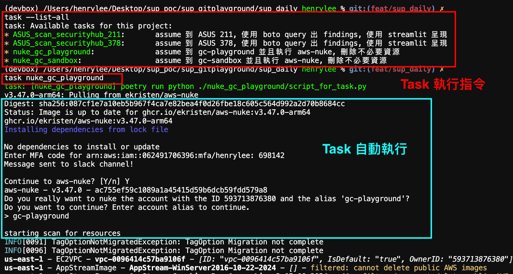

## sup_daily 工具包使用說明

### 製作目的

SUP team 目前的例行性任務，由不同類型的腳本執行，這個工具包，希望可以統一執行方式

### 工具包架構

1. poetry 管理 python 相關套件，避免套件之間的版本衝突
   - pyproject.toml
   - poetry.lock
2. task 統一任務的執行方式
   - Taskfile.yaml
3. 例行性任務 directory
   - scan-aws-security-hub
   - aws-nuke
   - ...

### 事前安裝、步驟

1. 請修改 **Taskfile.yaml** 檔案中的 `vars`
   - `asus_378_admin_profile_name`
     - 此變數為 aws-vault 中管理的 profile，請使用 ASUS 378 admin 的 profile 名稱
   - `asus_211_admin_profile_name`
     - 此變數為 aws-vault 中管理的 profile，請使用 ASUS 211 admin 的 profile 名稱

### 使用方式

1. `poetry env activate`
   - 獲得 poetry 啟用虛擬環境的指令
   - e.g.
   ```bash
   source src/sup-daily-yOdKgUn8-py3.12/bin/activate
   ```
   - 使用 source ... 啟用虛擬環境
2. `poetry install --no-root`
   - 安裝相關套件
3. `task --list-all`
   - 列出所有可執行任務
4. `task <特定 task 名稱>`
   

### Reference

各工具官方文件

1. [devbox](https://www.jetify.com/docs/devbox/)
2. [poetry](https://python-poetry.org/docs/)
3. [task](https://taskfile.dev/)
