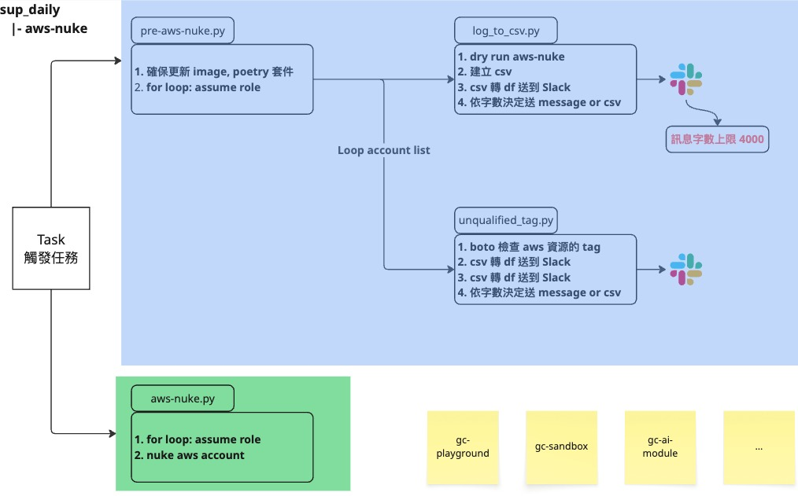
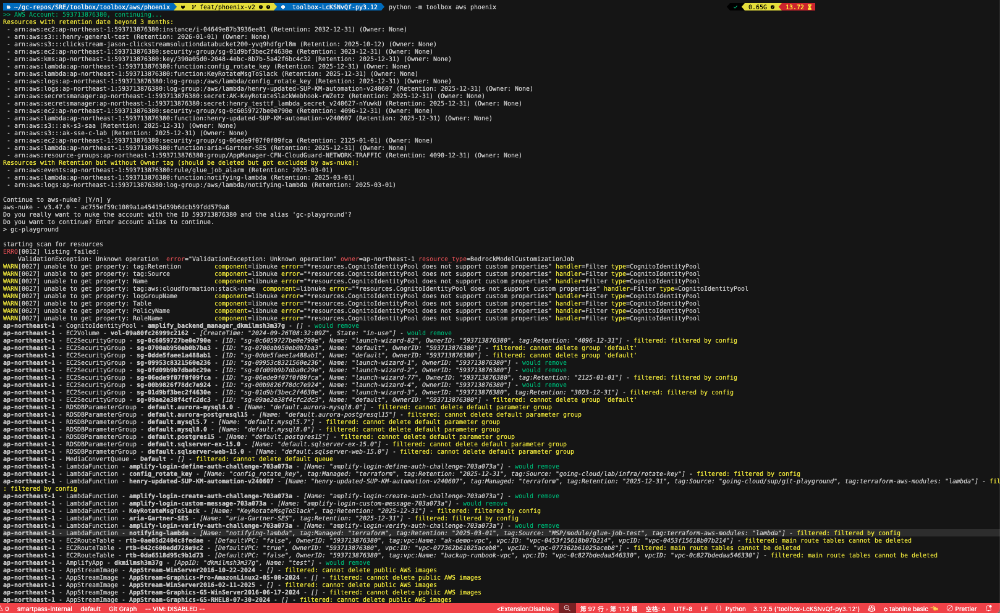

## User Guide for `aws-nuke`

### 腳本說明

1. 各腳本互動邏輯如下
   
2. _`pre-aws-nuke.py`_
   - 更新 aws-nuke image, poetry 相關套件
   - assume 進入指定的 aws account 並運行 _`log_to_csv.py`_, _`upqualified_tag.py`_
3. _`log_to_csv.py`_
   - dry run aws-nuke 並將輸出整理為 csv
   - 將被 aws-nuke 刪除的資源，傳送到指定的 slack channel
     - 字數少則上傳所有內文
     - 字數過多則上傳 csv 檔，避免 slack error
4. _`upqualified_tag.py`_
   - 篩選有打上 tag 的 aws 資源
   - 如 retention 保留日期，超過 100 天以上，將傳送到指定的 slack channel
     - 字數少則上傳所有內文
     - 字數過多則上傳 csv 檔，避免 slack error

### Config 檔案製作

1. 各個 linked account 的 config 檔案，儲存於同名的資料夾中
2. 如需新增範圍  
   a. 新增資料夾，並於資料夾中新增 config.yaml  
   b. 修改 .env 中的 `ACCOUNT_ALIAS_LIST`
3. config.yaml 是 aws-nuke 用於判定執行範圍的設置黨，範例如下

```yaml
regions:
  - ap-northeast-1
  - us-east-1
blocklist:
  - "999999999999"
resource-types:
  excludes:
    - CloudTrailTrail
    - S3Object
accounts:
  593713876380:
    filters:
      __global__:
        - property: tag:Retention
          type: dateOlderThan
          value: 1h
```

以下將分段說明 config 檔的主要組成

1. regions

- 目前列出所有 aws region，將不需要執行的 region 註解掉
- ESB 用法
  - 目前將所有 AWS region 放在檔案中，但僅針對以下 3 個 region 進行 aws-nuke
    - us-east-1：Virginia
    - us-west-2：Oregon
    - ap-northeast-1：Tokyo

2. blocklist

- 不執行 aws-nuke 的 account，至少須有一個值（AWS account ID）
- ESB 用法
  - 目前針對各個 linked account 有各自的 config
  - blocklist 又必須填一個值的情況，目前填寫 999999999999
  - 萬一不巧剛剛好 linked account ID 是 999999999999 時，將不會執行 aws-nuke
- 額外說明
  - aws-nuke 其實可以針對多個 AWS account 進行 nuke（可以於 config 中設置 accounts，然後在各個 account 下方分別設置 filters）
  - blocklist 則用於篩選掉 accounts 中的 AWS account

3. resource-types

- resource types 中，可以使用 includes 或 excludes 等等設置，近一步篩選 AWS account 中的資源是否要被 aws-nuke 刪除
- ESB 用法
  - 目前僅使用 excludes
  - excludes 目前分為兩個區塊
    - 實際上需要排除的資源，排除原因：checkpoint 資源、resource 不支援 tag
    - aws-nuke 運行時會產生 error 的資源（# no longer provides services 以下的部分）
  - `excludes` 排除的資源，後方都需要使用 # 註解說明為何排除
- 如想要查詢 aws-nuke config 中使用的資源名稱，請使用指令
  - `aws-nuke resource-types`

4. accounts

- accounts 之下，首先需要輸入 AWS account ID
- AWS account ID 之下，支援 resource-types
- resource-types 則同上方，也可設置 includes、excludes、filters
- ESB 用法
  - 目前針對各個 linked account 有各自的 config，所以 accounts 之下只會有一組 AWS account ID
  - AWS account ID 之下，只使用 filters

5. filter

- filters 之下，可以設置兩種內容

  - `__global__`
  - `resource-types`

- `__global__`，為全域適用，可針對 tag 進行更細緻的篩選

  - property，tag 的 key
  - type，篩選方式，可以使用 exact 或正則表達 regex
  - value，tag 的值

- `resource-types`，則同上方的 resource type

- 使用案例：不想要 aws-nuke 刪除名稱為 “henry-testing-bucket” 的 S3 bucket
- ```accounts:
  593713876380:
    filters:
      __global__:
        - property: tag:Retention
          type: dateOlderThan
          value: 1h
        - ...
      S3Bucket:
        - property: Name
          type: exact
          value: henry-testing-bucket
  ```

### 建議做法

案例：執行 pre-aws-nuke 時，如突然遇到需求，不要刪除某項資源，該怎麼做？

- 方法 1：於 resource-types 中，直接使用 excludes，將整個資源都排除

- 方法 2：於 accounts 的 filters 中，額外設置該資源，並使用 property / type / value 來客製化

- 差異，以 S3Bucket 為例：

  - resource-types → excludes，所有 S3Bucket 都不被 aws-nuke 刪除

  - accounts → filters → resource type → property …，指定的 S3Bucket，不會被 aws-nuke 刪除

- 建議做法：請直接使用 resource-types excludes

- 原因-1：如果誤刪資源，挺麻煩

- 原因-2：官方文件也聲明，filters 容易有錯誤或誤刪的情形

### Reviewing the Execution Result

The execution result will look like following:


Please check if all of the following requirements are met:

1. The filtered resources' Retention tag's value is in the future comparing to today.
2. The resources under `gc-admin/terraform` is filtered.
3. The resources name start with "CloudGuard" (case insensitive) are filtered.

### Reference

1. [aws-nuke 官方文件](https://aws-nuke.ekristen.dev/)
2. [aws-nuke github repo](https://github.com/ekristen/aws-nuke)
