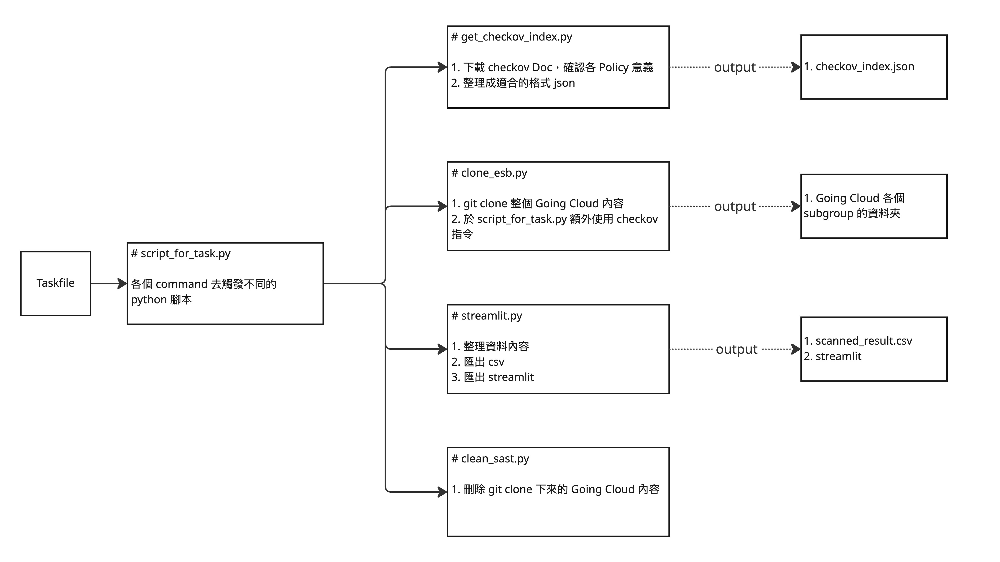
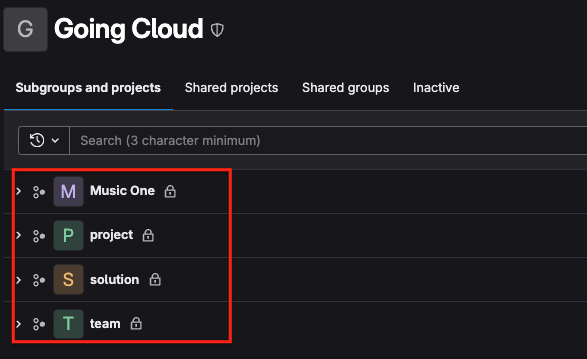
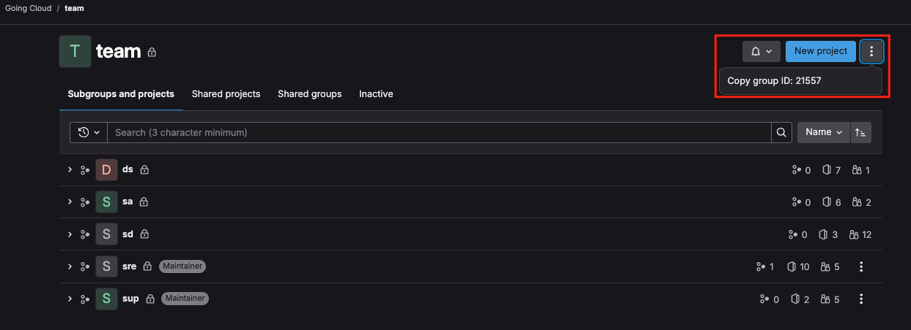

## 概述

這一個工具，將透過 Task 完全自動化執行，直到輸出為 csv 檔案與 streamlit 格式。  
可再將其複製到對應的 google sheet。

## 各腳本運行邏輯與說明

### 1. `get_checkov_index.py` - 收集規則清單

- **目的**: 從 checkov 官方下載規則的文件，然後整理成易讀的 `checkov_index.json` 檔案。
- **動作**:
  1. 下載檢查規則的文件並確認內容
  2. 將資料整理成一個清晰的 JSON 格式
- **結果**: 產出一個名為 `checkov_index.json` 的檔案

### 2. `clone_esb.py` - clone gitlab 資料

- **目的**: git clone 整個 Going Cloud 的內容。
- **動作**:
  1. 使用 `git clone` 下載整個 Going Cloud 專案
  2. 使用 click 將 clone 成功與否的提示套上顏色
- **結果**: 拿到整個 Going Cloud 的內容

### 3. `streamlit.py` - 整理並展示數據

- **目的**: 輸出最終成功的 csv 檔案與 streamlit 產出
- **動作**:
  1. 整理好所有的數據
  2. 將數據保存成 `scanned_result.csv` 表格
  3. 創建一個可視化的 Streamlit 頁面
- **結果**: 得到 `scanned_result.csv` 表格和 Streamlit 展示頁面

### 4. `clean_sast.py` - 清理多餘資料

- **目的是什麼**: 刪除之前下載的 Going Cloud 專案資料，保持環境乾淨。
- **步驟**:
  1. 刪除 `git clone` 下載的所有 Going Cloud 內容
- **結果**: 無產出

## 如何新增 scan 對象

- 於 .env > GROUPS_AND_DIRS 中更新 subgroup 名稱與 subgroup ID
- base_dir = subgroup 名稱，在可辨識的範圍內，請自行命名
  
- group_id 需進入各個 subgroup，於右上角的三個點內取得，以 team 為範例
  
